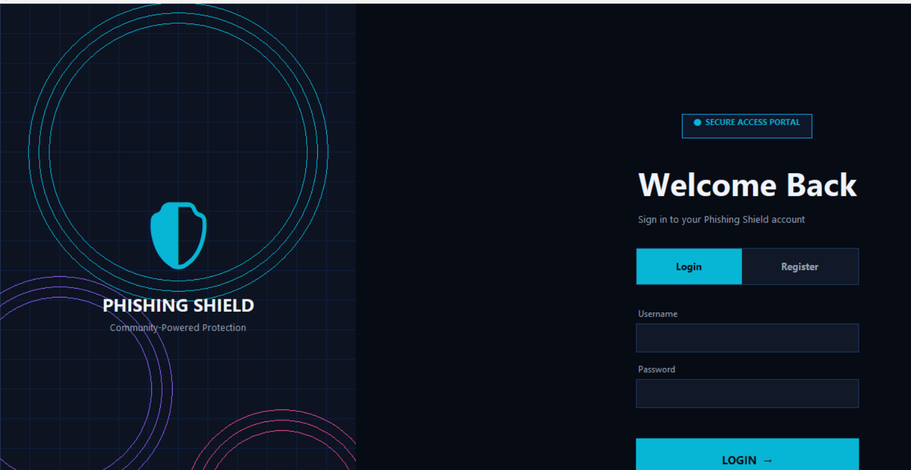
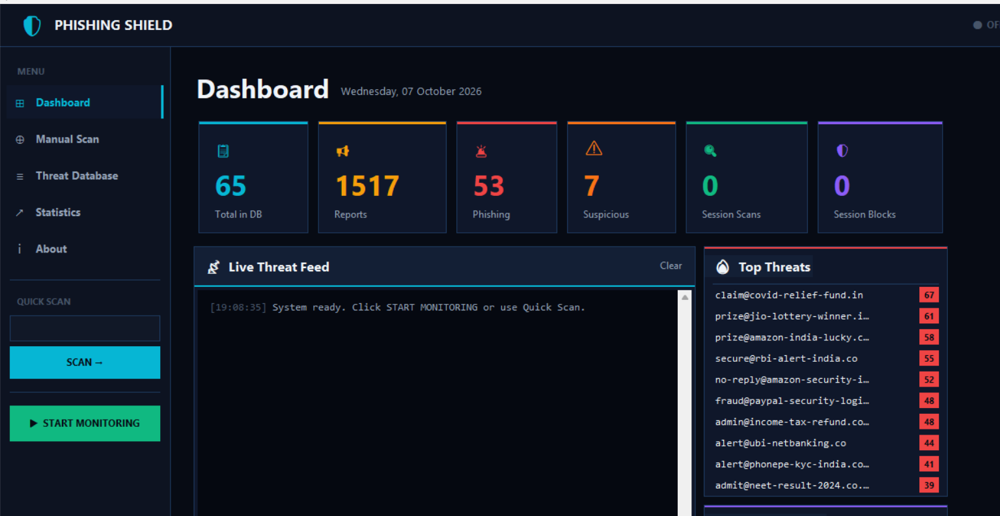
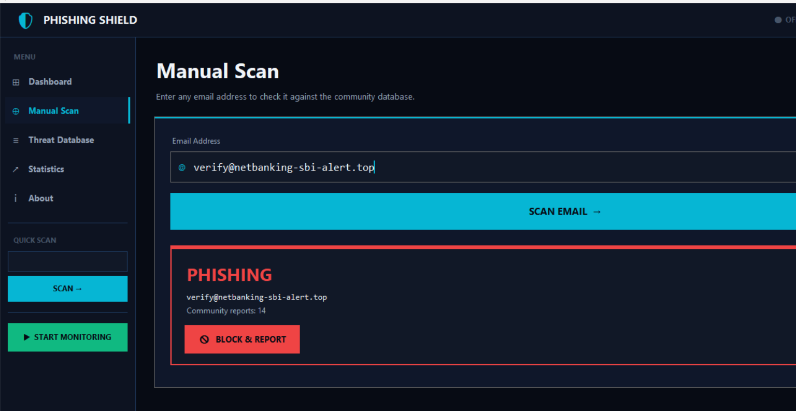
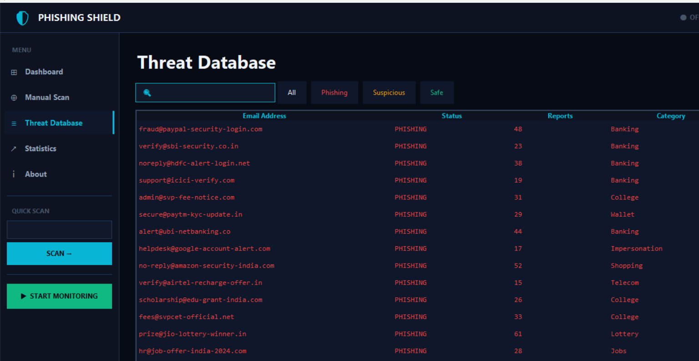
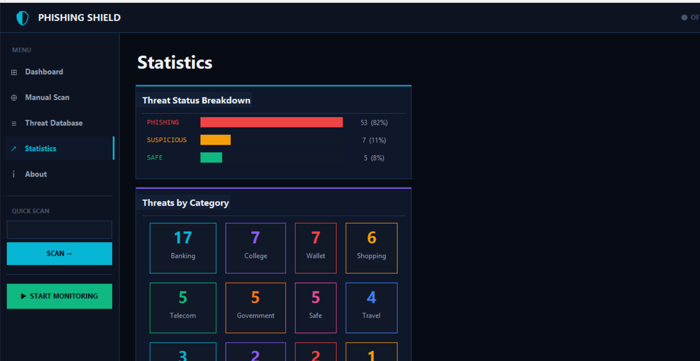

# 🛡️ Phishing Shield v3.0

**Community-Powered Phishing Detection - Desktop App + Web App + REST API**

> Like **Truecaller, but for emails.** Copy or paste any suspicious email address and get an instant verdict - SAFE, SUSPICIOUS, or PHISHING - powered by community reports **and** a heuristic detection engine.

**GitHub:** https://github.com/yashchavan24/PhishingShield
**Live Web App:** https://phishing-shield-three.vercel.app  (deployed from `web/`)
**Desktop exe (no Python needed):** https://github.com/yashchavan24/PhishingShield/releases/latest/download/PhishingShield.exe

> Login: admin / admin123

---

## Screenshots

### Desktop App (Python - Tkinter)

| Login | Dashboard |
|---|---|
|  |  |

| Manual Scan | Threat Database | Statistics |
|---|---|---|
|  |  |  |

### Web App (HTML/JS frontend - Python serverless backend)

- Scanner with heuristic reasons: /?email=verify@netbanking-sbi-alert.top -> PHISHING (suspicious TLD, brand impersonation, urgency keyword)
- Live threat table with search and status filters
- REST API section with copy-paste curl examples

---

## Problem Statement

College students receive phishing emails daily:

- "Urgent: Your SBI account will be suspended!"
- "SVPCET fee payment pending - pay now at http://svp-fee-notice.com"

Spam filters miss sophisticated phishing, and students have no quick way to verify an unknown sender. Phishing Shield solves this with a 1-second, zero-permission verdict engine powered by the community and a rule-based heuristic classifier.

---

## Features

### Core
- Real-time clipboard monitoring - copy any email, get an instant verdict
- Community threat database - 65 seeded entries, 1,500+ reports
- Three-level verdicts - SAFE / SUSPICIOUS (1-9 reports) / PHISHING (10+)
- NEW: Heuristic detection engine - catches never-before-seen phishing:
  - suspicious TLDs (.tk .xyz .top .click .link ...)
  - look-alike/typosquat domains (paypa1.com, g00gle.com)
  - brand names in unverified domains (sbi in sbi-alert.top)
  - urgency keywords (verify, kyc, suspended, prize...)
  - mostly-numeric local parts
- Community reporting - 1 report/device/day anti-abuse rate limit
- SHA-256 login system (desktop), device-ID hashing for privacy

### Desktop (Tkinter)
- Live threat feed, top-threats panel, quick scan, statistics, database browser

### Web (new in v3.0)
- Responsive dark-themed web app - scanner, threat table, stats, API docs
- Serverless Python backend on Vercel (/api/check, /api/report, /api/stats, /api/threats)
- Shareable verdict links - /?email=suspicious@site.xyz auto-scans

---

## How to Run

### Web app (Vercel)
Live at https://phishing-shield-three.vercel.app - no setup needed.

Run it locally instead:

    cd PhishingShield/web
    python devserver.py        # http://127.0.0.1:8000

### Desktop app
Option 1 - no Python: download the exe from the releases link above.

Option 2 - from source:

    pip install pyperclip
    python main.py

Default login: admin / admin123

### Offline demo API (great for the practical file)

    cd PhishingShield
    python server.py           # http://127.0.0.1:5000  (HTML demo UI at /)

### Rebuild the exe

    pip install pyinstaller
    pyinstaller PhishingShield.spec

---

## How It Works

    Copy suspicious email -> clipboard monitor (1s poll)
                         -> checker.py
                             1. whitelist?             -> SAFE
                             2. community reports >=10 -> PHISHING
                                community reports >=1  -> SUSPICIOUS
                             3. heuristic score >=3    -> PHISHING
                                heuristic score >=1    -> SUSPICIOUS
                         -> verdict + reasons in <1 second
                         -> report/block -> protects everyone

Example: verify@netbanking-sbi-alert.top has 0 reports but is still flagged PHISHING (score 4) because of .top + sbi brand + verify.

---

## Tech Stack

| Component | Technology |
|-----------|-----------|
| Desktop GUI | Python 3 - Tkinter |
| Clipboard monitor | Pyperclip + Threading + queue.Queue |
| Verdict engine | Whitelist + community DB + heuristic rules |
| Database | JSON (atomic writes, corruption-safe) |
| Web frontend | HTML5 + CSS3 + vanilla JavaScript |
| Web backend | Python serverless functions (Vercel) |
| Auth (desktop) | SHA-256 hashed credentials |
| Offline API | Python http.server REST bridge |
| Packaging | PyInstaller |

---

## Project Structure

    PhishingShield/
    |-- main.py               # Desktop GUI: login + dashboard
    |-- checker.py            # Verdict engine (whitelist -> DB -> heuristics)
    |-- database.py           # Thread-safe, corruption-proof JSON DB layer
    |-- reporter.py           # Community reporting + anti-abuse rate limit
    |-- clipboard_monitor.py  # Background clipboard watcher (thread-safe queue)
    |-- server.py             # Offline REST API + demo UI (python server.py)
    |-- db/threats.json       # Community threat database (65 entries)
    |-- users.json            # SHA-256 credentials
    |-- web/                  # -- Web app (deployed to Vercel) --
    |   |-- index.html        # Frontend
    |   |-- style.css         # Dark cyber theme
    |   |-- app.js            # Scanner + table + stats logic
    |   |-- api/check/        # POST verdict endpoint
    |   |-- api/report/       # POST community report endpoint
    |   |-- api/stats/        # GET statistics endpoint
    |   |-- api/threats/      # GET/search/filter DB endpoint
    |   |-- checker.py etc.   # Shared engine modules
    |   +-- devserver.py      # Local dev server (frontend + API)
    |-- docs/screenshots/     # GUI screenshots used in this README
    +-- requirements.txt      # pyperclip

---

## REST API

| Method | Endpoint | Body / Query | Returns |
|---|---|---|---|
| POST | /api/check | {"email": "..."} | verdict + reasons + score |
| POST | /api/report | {"email": "..."} | report confirmation (1/day/device) |
| GET | /api/stats | - | entries, reports, categories |
| GET | /api/threats | ?q=&filter= | searchable threat list |
| GET | /api/health | - | health probe |

    curl -X POST https://phishing-shield-three.vercel.app/api/check -H "Content-Type: application/json" -d '{"email":"verify@paypa1-security.com"}'

---

## Anti-Abuse Protection

| Layer | Protection |
|-------|-----------|
| Thresholds | 1 report = suspicious, 10 = phishing |
| Device limits | 1 report per device per email per day |
| Whitelist | Banks, govt, .ac.in/.gov.in always trusted |
| Privacy | Device IDs are SHA-256 hashed, never raw MACs |

---

## Real-World Impact

- Protects students from banking, fee-payment, scholarship and lottery scams
- Zero cost - runs offline (desktop) and on Vercel free tier (web)
- Heuristic layer catches zero-day phishing with no reports yet
- Doubles as a cybersecurity teaching tool

---

## Author

6th Semester Major Project
Department of Computer Science & Engineering (Cyber Security)
SVPCET, Nagpur - 2026

---

## License

MIT License - free to use and modify
